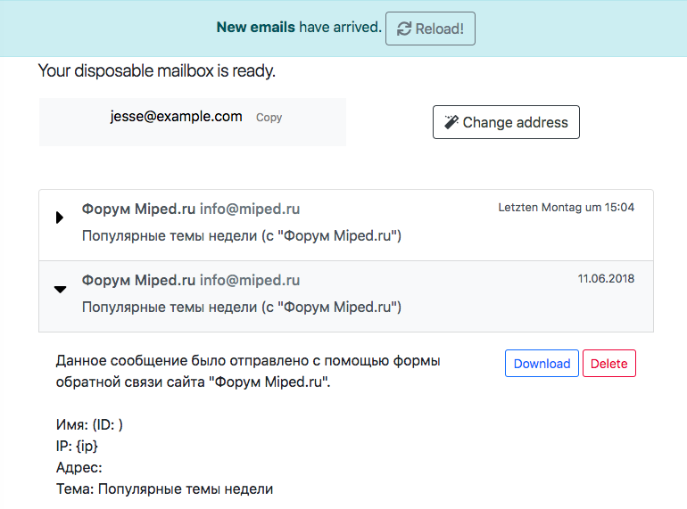

# self-hosted disposable email service

Create your own temporary email web-service by combining 
  * a [catch-all imap mailbox](https://www.google.ch/search?q=how+to+setup+catch-all+imap+mailbox) and 
  * this easy to install web-application. 

A random email address is created for every user and everything is updated automatically.  
Emails can also be deleted. 

|         | 
| ------------- | 

## You have to know

* Use  and you will be notified about issues and bugfixes.  
* This is **Beta** software, [there are still unsolved problems](https://github.com/synox/disposable-mailbox/issues). Contributions are welcome!
* License: **GPL-3.0**. You can modify this application and run it anywhere, charge money and show advertisement. Any forks or repacked distribution must follow the GPL-3.0 licence.  
* A link to https://github.com/synox/disposable-mailbox in the footer is appreciated.  

## Requirements

* webserver with php >=5.3.0
* php [imap extension](http://php.net/manual/book.imap.php)
* IMAP account and a domain with catch-all configuration (all emails go to one mailbox). 

## Installation

1. assure the [imap extension](http://php.net/manual/book.imap.php) is installed. The following command should not print any errors:

        <?php print imap_base64("SU1BUCBleHRlbnNpb24gc2VlbXMgdG8gYmUgaW5zdGFsbGVkLiA="); ?>

2. download a [release](https://github.com/synox/disposable-mailbox/releases) or clone this repository
3. copy the files in the `src` directory to your web server (not the whole repo!).
4. rename `config.sample.php` to `config.php` and apply the imap settings. Move `config.php` to a safe location outside the `public_html`.
5. edit `backend.php` and set the new path to `config.php`.
6. open it in your browser, check your php error log for messages. 

## Build it yourself
The src directory contains all required files. If you want to update the php dependencies, you can update them yourself.  You must have [composer](https://getcomposer.org/download/) installed. 

Install php dependecies:

    composer install

## Credit

This could not be possible without...

 * http://angularjs.org/
 * https://github.com/barbushin/php-imap
 * https://github.com/gregjacobs/Autolinker.js/
 * http://chancejs.com/
